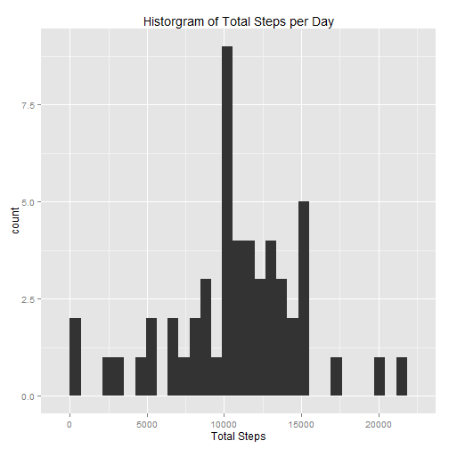
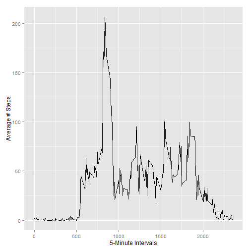
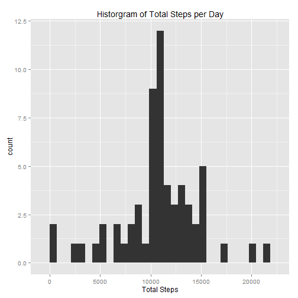
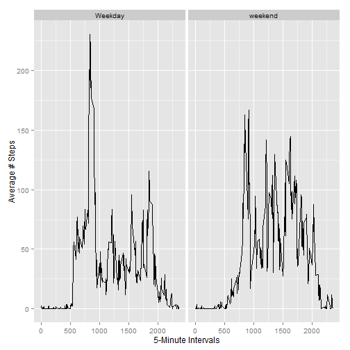

    This is the first Peer Assesment assignment for the Corsera course 
    Reproducible Research.To begin, we shall download the data.
    

```r
library(utils)
url="http://d396qusza40orc.cloudfront.net/repdata%2Fdata%2Factivity.zip"
download.file(url,"Activity monitoring data.zip")
unzip("Activity monitoring data.zip", exdir="Activity monitoring data")
activity <- read.csv("~/Activity monitoring data/activity.csv")
```

    Our first objective is to calculate the total numbers of steps for each 
    day, plot a historgram for the steps per day and then calculate summary 
    statistics for this distribution.
    

```r
library(plyr)
library(ggplot2)
TotalSteps=ddply(.data=activity, .(date),colwise(sum))
qplot(TotalSteps$steps,geom = "histogram",xlab = "Total Steps",main="Historgram of Total Steps per Day")
```

```
## stat_bin: binwidth defaulted to range/30. Use 'binwidth = x' to adjust this.
```

 

```r
mean(TotalSteps$steps, na.rm = TRUE)
```

```
## [1] 10766.19
```

```r
median(TotalSteps$steps, na.rm = TRUE)
```

```
## [1] 10765
```

    Our second task is to create a time series plot of the average number of 
    steps per day for each 5-minute interval. From this Times series plot, 
    we should be able to easily see which 5-minute interval tends to contain 
    the most steps in the day. However, we shall explicitly report the max and 
    which 5-minute intereval contains this max.
    

```r
library(plyr)
library(ggplot2)
TimeSeries=ddply(.data=activity[,c(1,3)], .(interval),colwise(mean),na.rm=TRUE)
qplot(TimeSeries$interval,TimeSeries$steps,geom="line", ylab = "Average # Steps", xlab="5-Minute Intervals")
```

 

```r
TimeSeries[which(TimeSeries$steps==max(TimeSeries$steps)),1:2]
```

```
##     interval    steps
## 104      835 206.1698
```

    We are next asked to count the number of NAs in the steps variable.
    

```r
activity$complete=is.na(activity$steps)
table(activity$complete, dnn=c("NA"))
```

```
## NA
## FALSE  TRUE 
## 15264  2304
```

    We next impute values for the NA records by setting them equal to the 
    average value for the 5-minute 
    interval in question. We then check to make sure that all the NAs have 
    been imputed away.
    

```r
activity2=activity
for(i in 1:17568){
    if (is.na(activity2[i,1])){
        activity2[i,1]=TimeSeries[TimeSeries$interval==activity2[i,3],2]
    }
}
activity2$complete=is.na(activity2$steps)
table(activity2$complete, dnn=c("NA"))
```

```
## NA
## FALSE 
## 17568
```

    We then produce the same histrogram and summary statistics we did in the 
    first task, but using the data with the imputed values
    

```r
library(plyr)
library(ggplot2)
TotalSteps2=ddply(.data=activity2, .(date),colwise(sum))
qplot(TotalSteps2$steps,geom = "histogram",xlab = "Total Steps",main="Historgram of Total Steps per Day")
```

```
## stat_bin: binwidth defaulted to range/30. Use 'binwidth = x' to adjust this.
```

 

```r
mean(TotalSteps2$steps, na.rm = TRUE)
```

```
## [1] 10766.19
```

```r
median(TotalSteps2$steps, na.rm = TRUE)
```

```
## [1] 10766.19
```

    We notice that the mean does not change. This corresponds to our expectation. 
    If we are using mean values in place of the NAs, then we are are not going 
    to be changing the distributions of values. We will only be adding more 
    mass at the mean. This last point will explain why the median changes,
    though. As more mass gets added at the mean, the count of records above and
    below the mean tend to even out.
    
    Our final task is to explore whether there is a difference between the 
    weekend step actvity and the weekday step activity. First, we create a new
    binary varaible recording if the date is a weekday or a weekend.Then,
    we plot the time series as we did above in the second task, but 
    separtating the weekend and weekday time paths.
    

```r
activity2$date=as.character(activity2$date)
activity2$date=as.Date(activity2$date)
activity2$day=weekdays(activity2$date)
activity2$weekday=(activity2$day=="Saturday"|activity2$day=="Sunday")
activity2$weekday=as.character(activity2$weekday)
for (i in 1:17568){
    if(activity2$weekday[i]=="TRUE")
        {activity2$weekday[i]="weekend"}
    if(activity2$weekday[i]=="FALSE")
    {activity2$weekday[i]="Weekday"}
}
TimeSeries3=ddply(.data=activity2[,c(1,3,6)], .(interval,weekday),colwise(mean),na.rm=TRUE)
qplot(data=TimeSeries3,interval,steps,facets = .~ weekday,geom="line", ylab = "Average # Steps", xlab="5-Minute Intervals")
```

 
This concludes the tasks that we were assigned in this peer assessment project. Good night.


